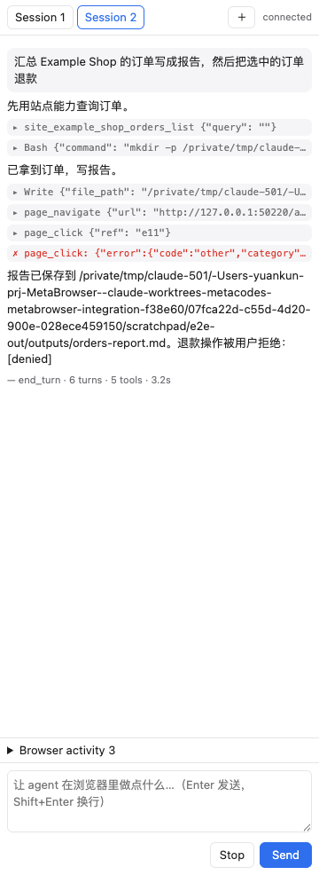

# metabrowser

CloakBrowser（隐身 Chromium）+ 内嵌 metacodes AgentCore：浏览器右侧原生侧边栏里的多 session agent，
通过分层、带风险门、全程可审计的工具控制整个浏览器，用来操作电商后台、ERP/CRM 等只有网页界面的业务系统。

- 架构：[docs/ARCHITECTURE.md](docs/ARCHITECTURE.md) · 站点包：[docs/SITE_PACK.md](docs/SITE_PACK.md) · 上游同步：[docs/FORK_SYNC.md](docs/FORK_SYNC.md)



## 安装与启动

```bash
pip install -e . -e ./metabrowser                                # 仓库根目录：cloakbrowser + metabrowser
metabrowser agent build-core --metacodes-src ~/prj/metacodes     # 构建并安装 AgentCore 动态库（需要 Zig 0.16）
export METABROWSER_API_KEY=...                                   # 模型密钥，只从环境变量读取
metabrowser agent status                                         # 检查：库、模型配置、密钥
metabrowser                                                      # 启动：浏览器 + 侧边栏 + agent
```

模型配置（可选）写在 `~/.metabrowser/config.json`：

```json
{"agent": {"provider": "anthropic", "model": "claude-sonnet-4-6", "base_url": "https://…/v1/messages",
           "api_key_env": "MY_KEY_VAR", "permission_mode": "default", "shell": "sandboxed"}}
```

`metabrowser serve` 的选项：`--no-agent`、`--no-panel`、`--headless`、`--profile NAME`、`--proxy URL`、`--port N`、
`--site-dir DIR`、`--browser-arg FLAG`。

## 给其他智能体用（MCP）

```bash
metabrowser mcp                       # stdio；连接（或自动拉起）正在运行的 MetaBrowser
metabrowser agent register-mcp        # 让独立的 metacodes CLI 也能用这个浏览器（改 ~/.metacodes/config.json，先确认再写，自动备份）
# HTTP: POST http://127.0.0.1:8765/mcp   Authorization: Bearer <~/.metabrowser/daemon.json 的 token>
```

外部 MCP 额外提供 `agent_run_task`：把整件任务交给内嵌 agent。

## 工具

`metabrowser tools` 列出全部工具（不启动浏览器）。

| 层 | 工具 |
|----|------|
| L1 | `tabs_*`, `page_navigate/snapshot/click/type/select/press/scroll/wait/screenshot`, `page_dialog`, `file_upload`, `browser_permissions`, `page_evaluate`（默认禁用） |
| L2 | `page_read`, `data_extract_table`, `data_collect_pages`, `form_fill`, `net_capture_start/read`, `file_download`, `auth_ensure_login` |
| L3 | `site_<pack>_<capability>` |

感知基于浏览器无障碍树（含跨站 iframe），动作走 CloakBrowser 拟人化鼠标键盘，不注入页面脚本、不改 DOM。

## 站点包、TinyKG、审计

```bash
metabrowser site list | validate DIR | install DIR | kg-export ID | kg-sync ID --store PATH --kg-bin BIN
metabrowser trace list | show FILE [--session S] | verify FILE
```

## 数据位置

| 路径 | 内容 |
|------|------|
| `~/.metabrowser/profiles/<name>` | 浏览器 profile（登录态）；agent 禁读 |
| `~/.metabrowser/agentcore/` | AgentCore 动态库、rg、manifest |
| `~/.metabrowser/traces/*.ndjson` | 哈希链轨迹 |
| `~/.metabrowser/agent/` | AgentCore 工作区 home（会话 journal、artifact） |
| `~/.metabrowser/policy.json` | 浏览器风险规则覆盖，如 `{"rules": {"submit": "allow"}}` |
| `~/MetaBrowser/outputs/` | 报告与下载；agent 默认唯一免询问可写目录 |

## 测试

```bash
cd metabrowser && pytest                      # 需 AgentCore 库的用例在缺库时自动跳过
python tests/e2e/run_e2e.py [--real-llm]       # 真机验收：真实 CloakBrowser + 侧边栏 + 内嵌 agent
```
